URL: https://github.com/mozolin/esp32c6_zigbee  
  
# Example: BMX280 & DS18B20 & BH1750 sensors with ESP32-C6 (Espressif IDE)  
  
Zigbe2MQTT Settings:  
[Example: Zigbee2MQTT CC2538 settings for ESP32-C3, ESP32-C6 and CC2530](https://github.com/mozolin/Zigbee2MQTT_CC2538)  

# Make firmware for ESP32-C6 in Espressif IDE
  
1) The circuit might look like this  
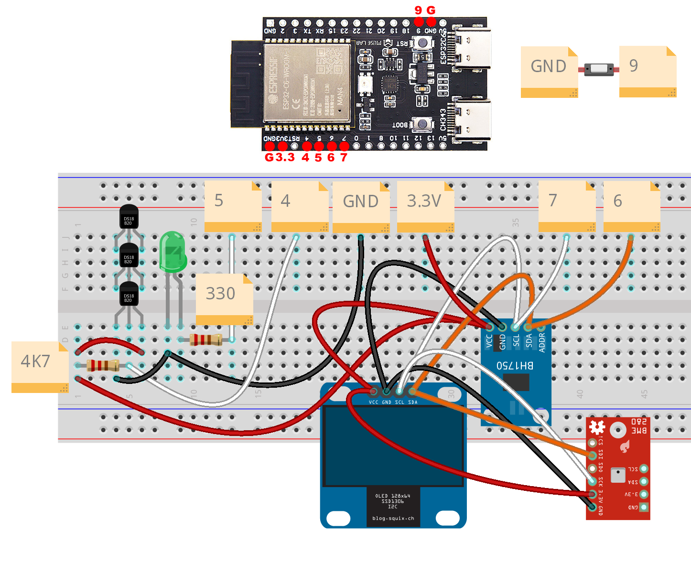  
    
2) Install Espressif IDE (https://dl.espressif.com/dl/esp-idf/)  
  
3) Open «Import» - «Existing IDF Project»  
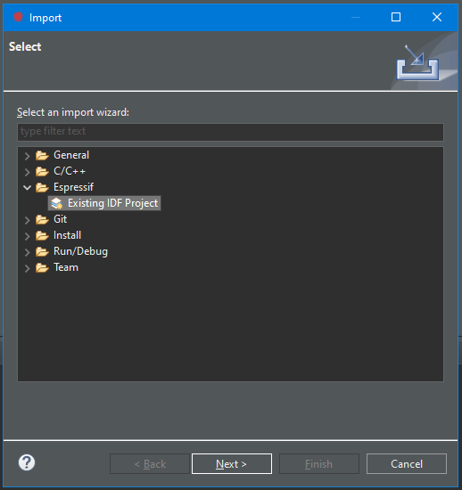  
  
4) Choose the project folder  
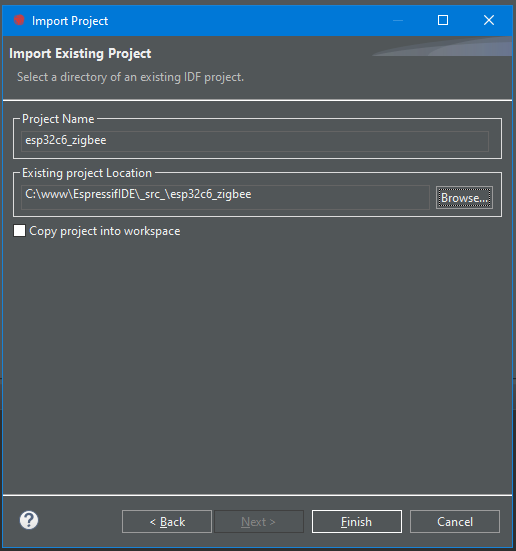  
  
5) Set the correct COM-port to upload firmware  
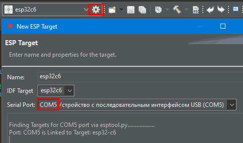  
  
6) Run the project (it will be built and uploaded into flash)  
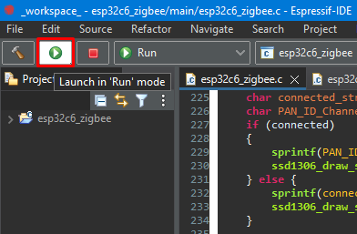  
  
7) The build and upload process can be viewed in the Console  
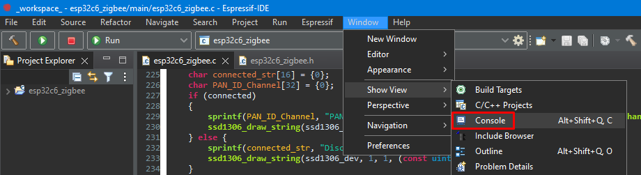  
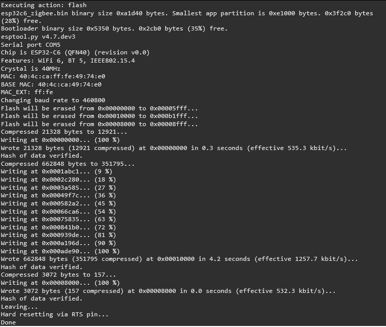  
  
8) Open the Terminal to view the software’s progress  
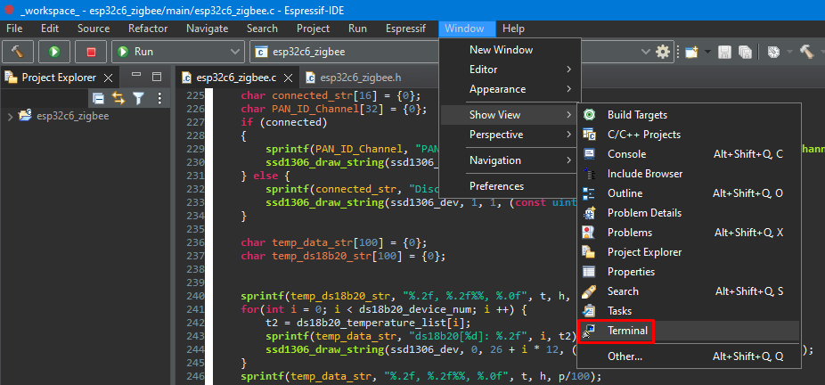  
  
9) Set the correct COM-port for the Terminal  
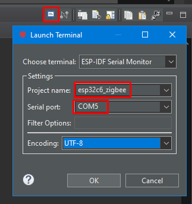  
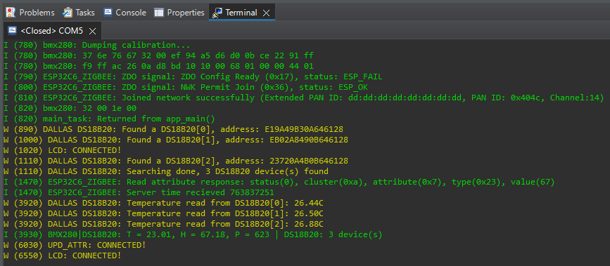  
  
10) The Terminal connection can be disconnected at any time  
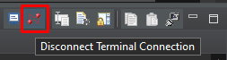  
  
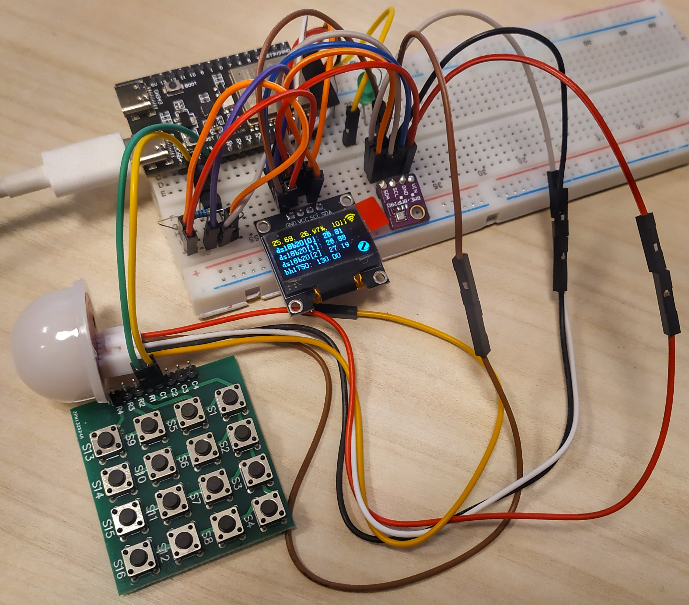  
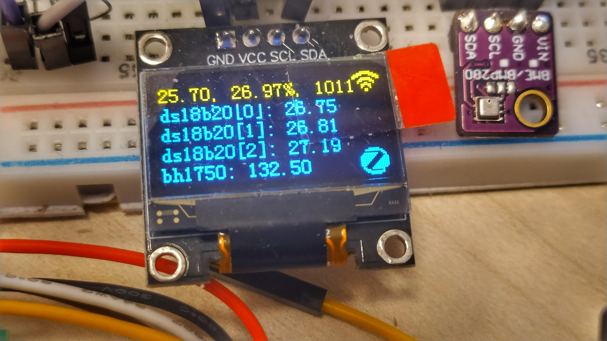  
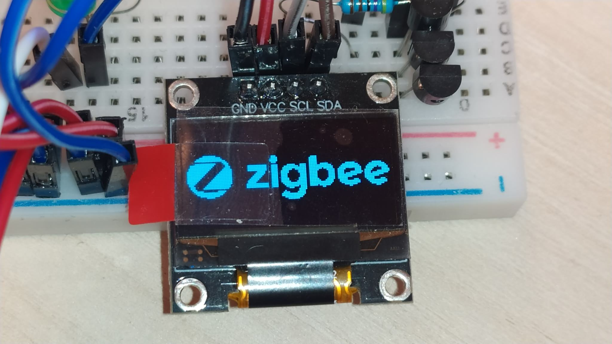  
